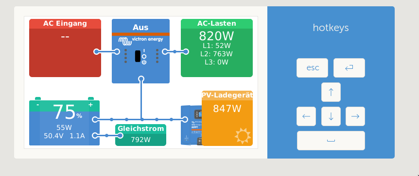
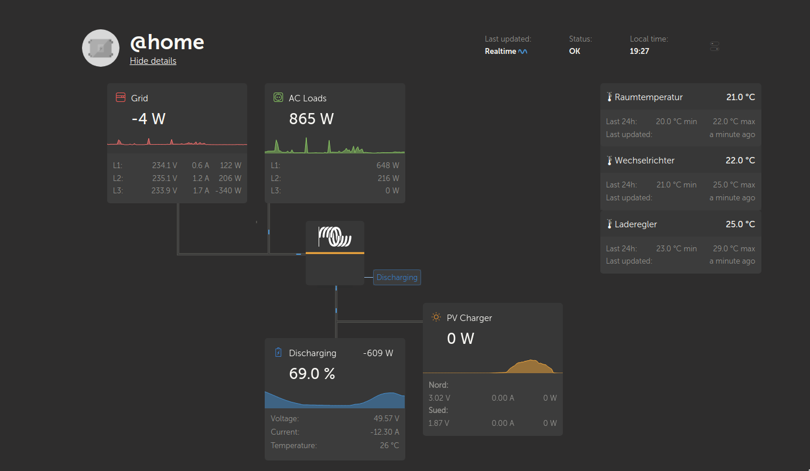
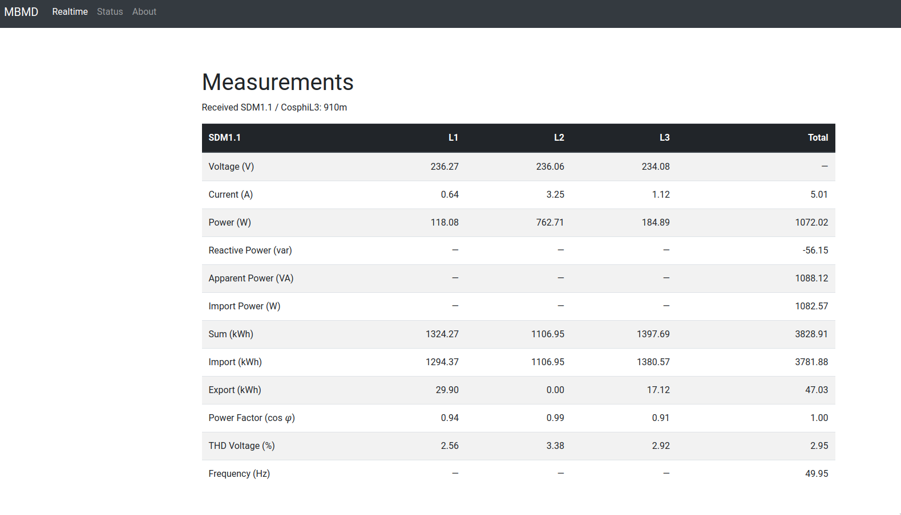
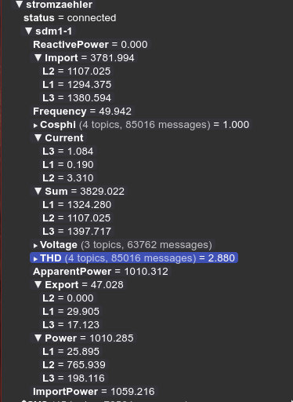

# Victron Eastron SDM630 Bridge (Alternative to the EM24)

This small program emulates the Energy Meter (EM24) in a Victron ESS System. It reads values from an existing MQTT Broker (in my case MBMD) and publishes the result on dbus as if it were the SDM630 meter.




Use this at your own risk, I have no association with Victron or Eastron and am providing this for anyone who already has these components and wants to play around with this.

I use this privately, and it works in my timezone, your results may vary.

__Update:__ Having owned a Multiplus II now, I can confirm that it works flawlessly with the ESS!

Special Thanks to Sean (mitchese) who did most of the work for the shm-et340.
Mostly of the code is forked from his repo. You can find it here:
[Repo](https://github.com/mitchese/shm-et340)

VRM Portal



# Tested Venus OS Version

* 18.03.2022 v2.84
* 10.02.2023 v2.92

# Setup

## Install MBMD

To load the data from the EASTRON power meter into your MQTT Broker, please use the mbmd program. You can find more information here: [Volkzaehler/mbmd](https://github.com/volkszaehler/mbmd)



Here is an example of how the SDM630 data looks in the broker:



example mbmd autostart added in `/data/bridge/startup.sh`:
```
#!/bin/bash
while true; do
        /data/bridge/mbmd run -a IpOfModbusToTcpOrModbusToUsbPath:502 --rtu -d='sdm:1' --mqtt-broker='127.0.0.1:1883' --mqtt-topic='stromzaehler' &
        /data/bridge/sdm630-bridge --broker=127.0.0.1 --port=1883 --topic='stromzaehler/#' --client-id='grid-meter-bridge'
        sleep 1
done
```

# Configuration

## Change Default Configuration

You can use CLI flags to set the proper values for your setup but if you want you can also change the defaults in  the `./main.go` file:
```
var (
    broker     = "192.168.1.119"
    brokerPort = 1883
    topic      = "stromzaehler/#"
    clientId   = "sdm630-bridge"
    username   = "user"
    password   = "pass"
)
```

## Compiling from source

To compile this for the Venus GX (an Arm 7 processor), you can easily cross-compile with the following:

```
`GOOS=linux GOARCH=arm GOARM=7 go build -o bin/arm/bridge/sdm630-bridge main.go`
```

You can compile it also with the make command:
```
make compile
```

## Update go modules

```
go get -u && go mod tidy
```

## Copy the file to your Venus OS device (e.g. CerboGX)

You will need SSH access to your Venus GX device. You can find more information here: [Venus OS: Enable SSH](https://www.victronenergy.com/live/ccgx:root_access#set_access_level_to_superuser)
```
scp -rp ./bin/arm/bridge root@CerboGX:/data/
```

## Start the program

Login in via ssh to your Venus Device:
```
ssh root@CerboGX
```

Start the program:
```
cd /data/bridge
./sdm630-bridge --broker=192.168.1.119 --port=1883 --username=user --password="pass" --topic="stromzaehler/#" --client-id="grid-meter-bridge"
```

# Autostart on Venus OS

The only directory that is unaffected by an update is the /data directory.
If there is an executable file with the name rc.local, it will be executed
when the system is started. This makes it possible to start the
sdm630-bridge automatically.

## Create rc.local file

Login into the system via ssh. Create a file with the following command:
```
vi /data/rc.local
```

Add the following content:
```
#!/bin/bash
sleep 20 && /data/bridge/startup.sh > /data/bridge/sdm630-bridge.log 2>&1 &
```

Save the file and make them executable:
```
chmod +x /data/rc.local
```

## Create the startup script
```
cd /data/bridge/
vi startup.sh
```

Paste the following content into the startup script, remember to change the CLI arguments to suit your environment:
```
#!/bin/sh
while true; do
  /data/bridge/sdm630-bridge --broker=192.168.1.119 --port=1883 --username=user --password="pass" --topic="stromzaehler/#" --client-id="grid-meter-bridge"
  sleep 1
done
```

Save the file and make them executable:
```
chmod +x /data/bridge/startup.sh
```

Reboot the system and check if the process come up.
```
ps | grep sdm630
```
# Victron Grid Meter Values

[Source Victron](https://github.com/victronenergy/venus/wiki/dbus#grid-meter)

```
com.victronenergy.grid

/Ac/Energy/Forward     <- kWh  - bought energy (total of all phases)
/Ac/Energy/Reverse     <- kWh  - sold energy (total of all phases)
/Ac/Power              <- W    - total of all phases, real power

/Ac/Current            <- A AC - Deprecated
/Ac/Voltage            <- V AC - Deprecated

/Ac/L1/Current         <- A AC
/Ac/L1/Energy/Forward  <- kWh  - bought
/Ac/L1/Energy/Reverse  <- kWh  - sold
/Ac/L1/Power           <- W, real power
/Ac/L1/Voltage         <- V AC
/Ac/L2/*               <- same as L1
/Ac/L3/*               <- same as L1
/DeviceType
/ErrorCode
```

# ToDo

- [ ] Check Update process -> https://www.victronenergy.com/live/ccgx:root_access

